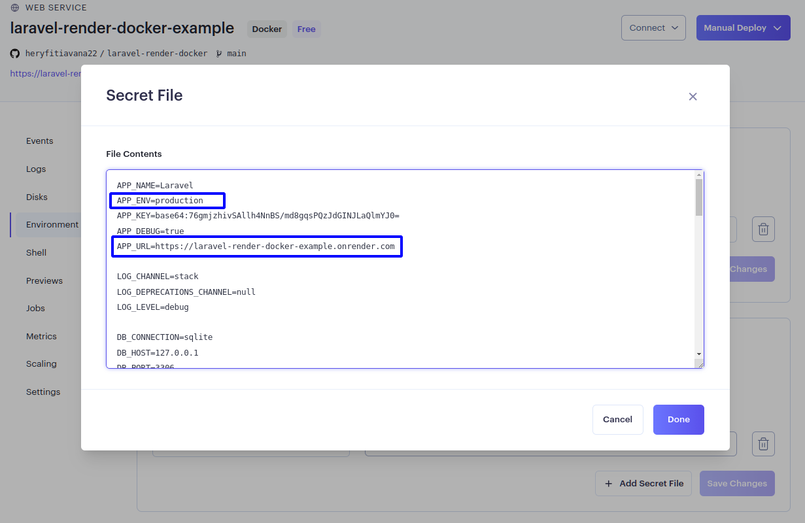

# Laravel-render-docker

## Dockerize laravel on render

This repository provides instructions for deploying a Laravel application on [Render](https://render.com/). You can see this example [here](https://laravel-render-docker-example.onrender.com). If you are using React, follow the instructions in the branch [react](https://github.com/heryfitiavana22/laravel-render-docker/tree/react).

## Requirements

-   [Docker](https://docs.docker.com/) installed on your machine
-   [Render](https://render.com/) account

### Dockerfile

The `Dockerfile` contains instructions for building the Docker image of your application. You can find the Dockerfile for my image `herydj/laravel-php-render` in the `.docker` folder.

```dockerfile
FROM herydj/laravel-php-render

WORKDIR /app

# uncomment if you want to use nodejs
# RUN apt-get install nodejs -y
# RUN apt-get install npm -y

COPY . .

RUN chmod +x ./start.prod.sh

RUN composer install

# if using nodejs
# RUN npm install
# RUN npm run build

# uncomment if using a database other than sqlite
# RUN php artisan migrate -n

RUN php artisan storage:link
RUN php artisan key:generate

EXPOSE 8000

CMD ["./start.prod.sh"]
```

### Command start

Create file `start.prod.sh` in the project root and paste the content below :

```bash
rm public/hot

# if using sqlite
touch database/database.sqlite
php artisan migrate -n

php artisan serve --host=0.0.0.0 --port=8000
```

### Deployment on render

-   Create account if you don't have : [render](https://render.com/)
-   Go to the dashboard and create a new web service : `New + ` > ` Web Service` > And connect the repository
-   In the configuration, make runtime to `Docker`


-   Create your web service with the button `Create Web Service`
-   Setup environment, go to `Environment` > click the button `Add Secret File`
    

-   Make filename to `.env`, the paste the `.env` file content and change the `APP_ENV` and `APP_URL` value like this :
    

    - Finally, click `Done` > `Save Changes`. Wait deploying and see your app 😎😉

## Related

Here are some related link

-   [Laravel](https://laravel.com/)
-   [Docker](https://www.docker.com/)
